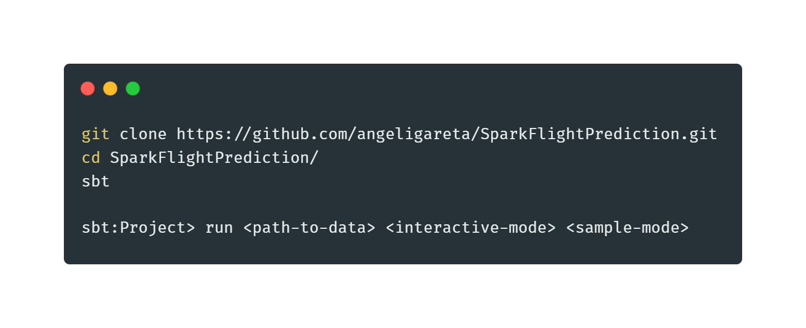

<h1 align="center">Prediction in Flights Arrival Time</h1>

  
  

## Objective
The objective of this project is to predict the arrival delay of plane landings, given a set of variables. We will extract the feature data from different files containing the flight information of all the USA’s flights between 1987 and 2008.

For achieving the objective of the project we are going to use the data collected by the national [Bureau of transportation](http://stat-computing.org/dataexpo/2009/the-data.html) statistics, an American public organisation responsible for collecting information about commercial flights.  The period of time covered by this data is 22 years, from 1987 to 2008.

## Implementation
The application has been developed in scala programming language using Spark API for scala. Apart from the open-source build tool sbt has been used, so it can be more easily executed.

In order to run the application, the following commands should be executed. 

The main object ArrDelayPredictorwill be executed with run. The commands available for ArrDelayPredictor are:
- **Path To Data:** Path where the input files would be located.  It can accept a single dataset or multiple onesthrough the path of a folder.
- **Interactive mode:** If the second parameter is set to true, the program will run in interactive mode, asking bycommand line which machine learning model to use to train or test the data.  The available ones are ”lr” forlinear regression, ”dt” for decision tree and ”rf” for random forest.
- **Sample mode:** If the third parameter is set to true, instead of taking all the data from the path to data, itfirst reads all the data and take a random sample of 1.5 million rows,  to train a model in a faster and morerepresentative way.

*Note: The last two commands are set to false by default, but if the user wants to specify the sample mode, the second parameter must be set too. In the end of the execution the accuracy of the model will be shown in all the available measures.* 

On top of that, the trained model and the read data will be saved in order to execute the process much faster next time.

## Results
### Linear regression
We trained a linear regression model four times, in order to use the different combinations, obtaining the following results:

### Decision Tree
The results for the same combinations for decision tree were:

### Random Forest
The results for the same combinations for random forest were:

### Conclusions
After executing linear regression, random forest and decision tree machine learning models, we have chosen the decision tree with numerical time variables, and non transformationin the response variable as our best model. We did that election because of the good results in all the statistic measures.After having chosen the model, we decided to improve it using hiperparameter tuning with those two parameters:
- MaxBins: We have trained with the possible values 7500 and 10000.
- MaxDepth: As maximum depth of the model we chose 5, 7 and 9 as possible values.

With that list of paramters, the model had to do a training process of 6 steps, each one for the different combinations of parameters. After that, the result was represented in the following table:

As we can see, with the process of hyperparameter tuning we increased the R2 to value 0.85 and decreased the Mean Squared Error to 181.144.
